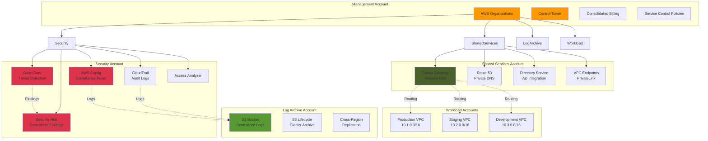
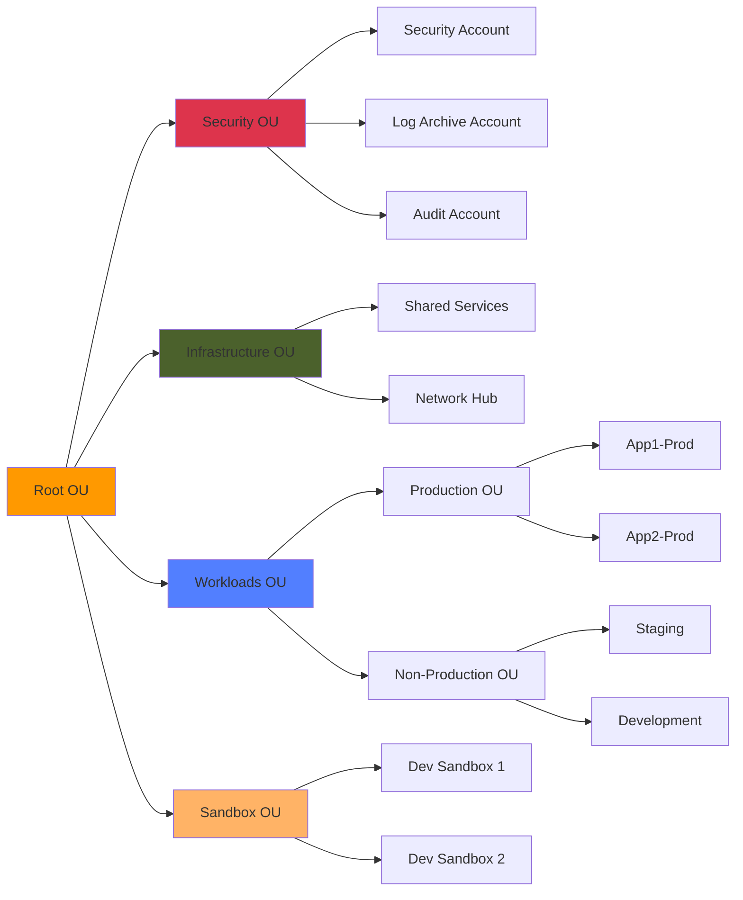
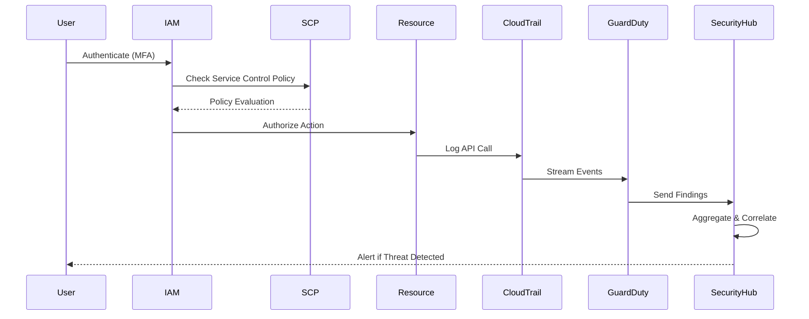
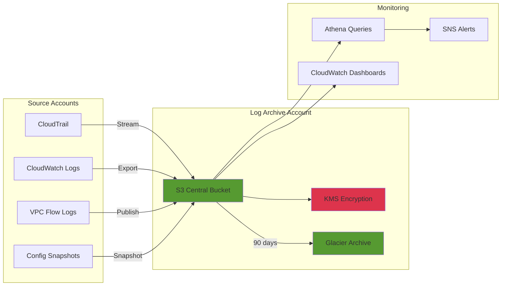
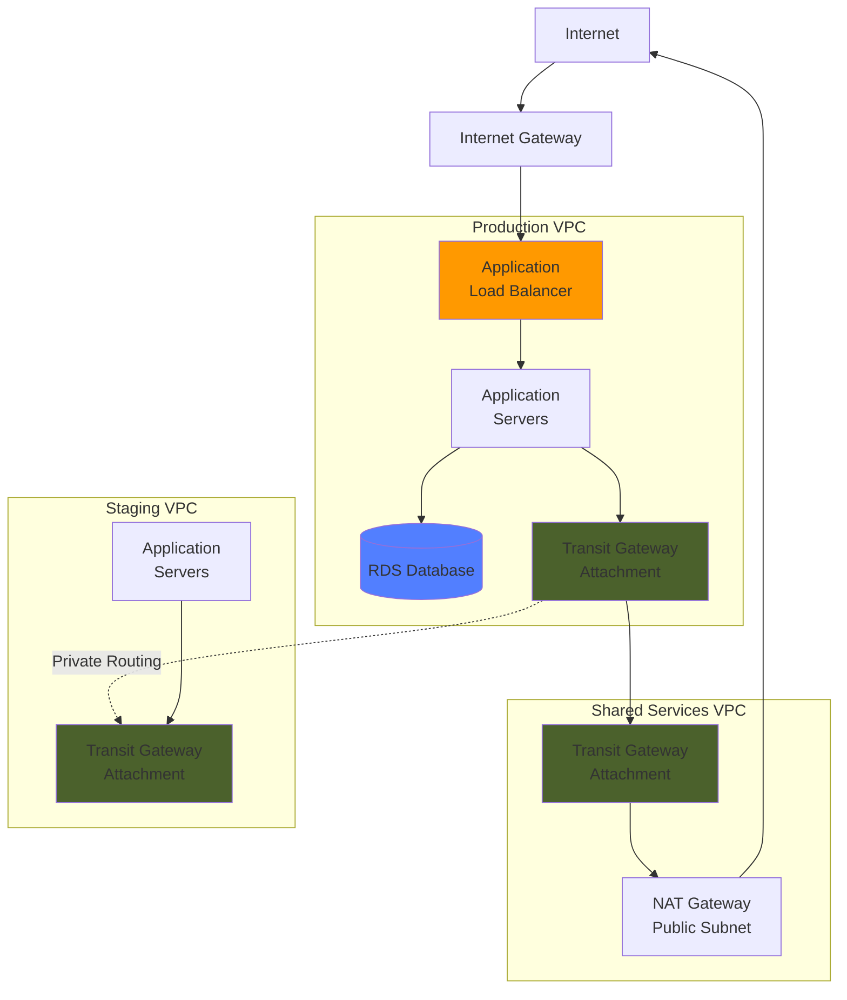
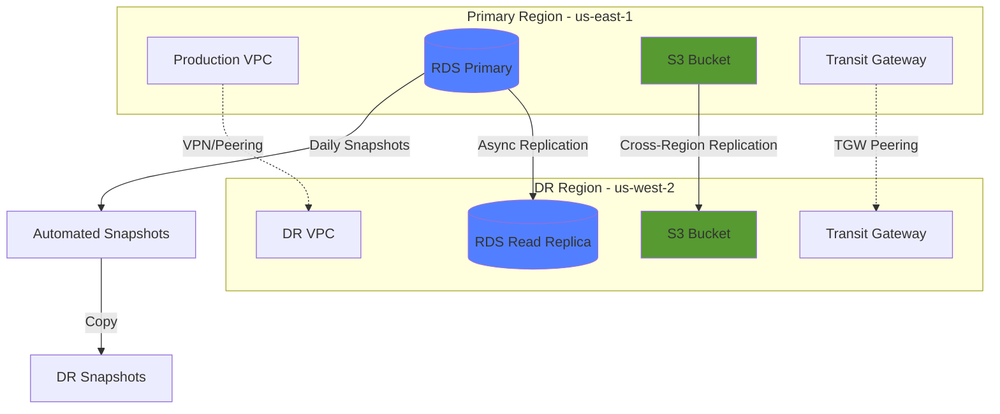
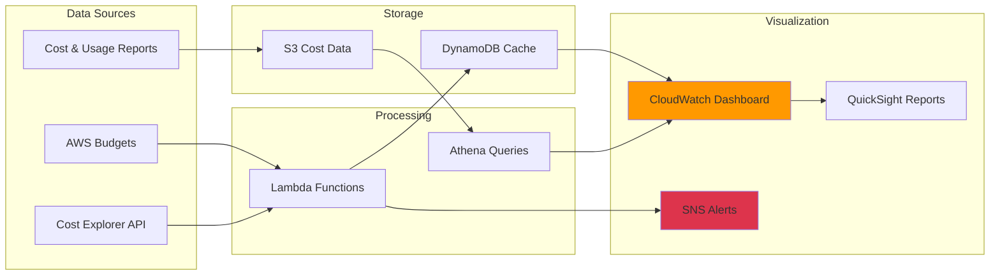

# AWS Enterprise Landing Zone - High Level Architecture

## Overview Architecture Diagram

## Account Structure

## Security Controls Flow

## Data Flow - Centralized Logging

## Network Traffic Flow

## Disaster Recovery Architecture

## Cost Monitoring Architecture

## Legend

| Color | Purpose |
|-------|---------|
| 🟠 Orange | Management/Core AWS Services |
| 🔴 Red | Security Services |
| 🟢 Green | Storage/Data Services |
| 🔵 Blue | Compute/Database Services |
| 🟤 Brown | Networking Services |

## Architecture Principles

### Multi-Account Strategy
- **Isolation**: Each workload in separate account
- **Blast Radius**: Limits security incidents
- **Billing**: Clear cost allocation per team/project

### Hub-and-Spoke Network
- **Centralized Routing**: Single point of egress
- **Scalability**: Easy to add new VPCs
- **Security**: Inspection at central hub

### Security Layers
- **Preventive**: SCPs, IAM policies, NACLs
- **Detective**: GuardDuty, Config, CloudTrail
- **Responsive**: Automated remediation, alerts

### Operational Excellence
- **Automation**: Infrastructure as Code
- **Monitoring**: Centralized observability
- **Documentation**: Living architecture docs
