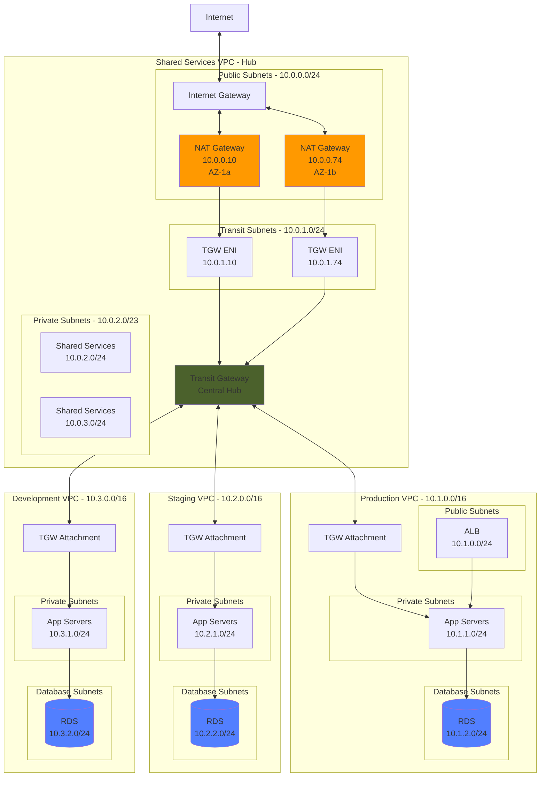
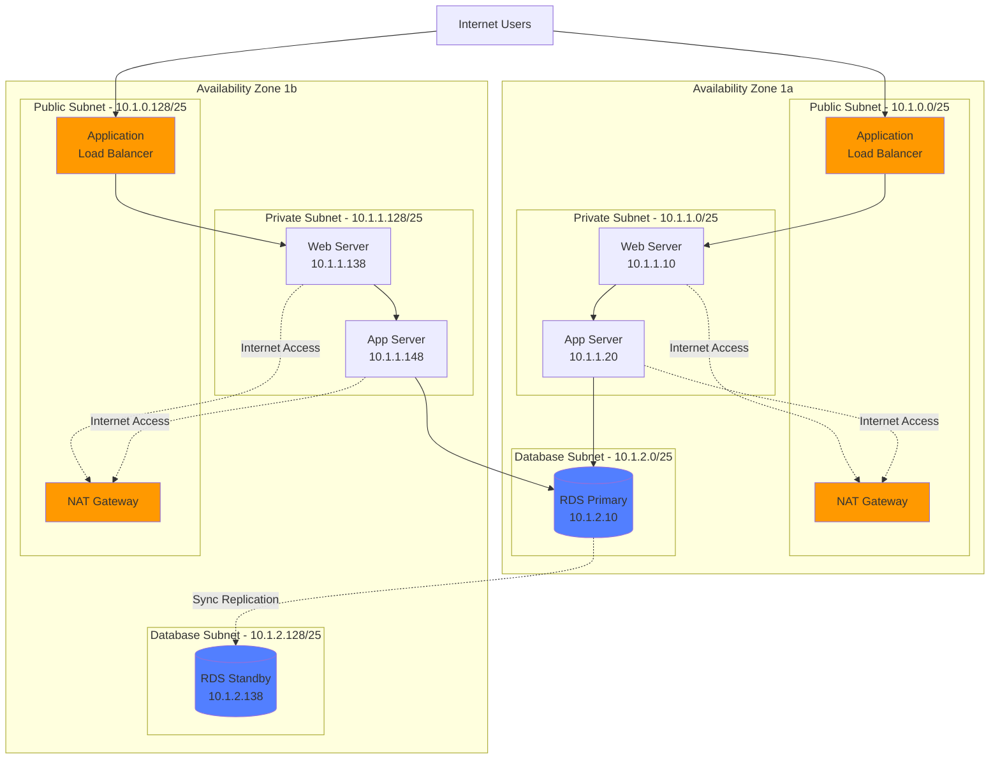
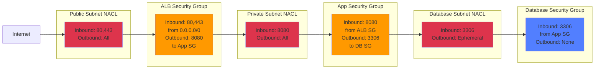
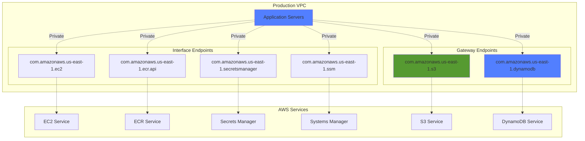
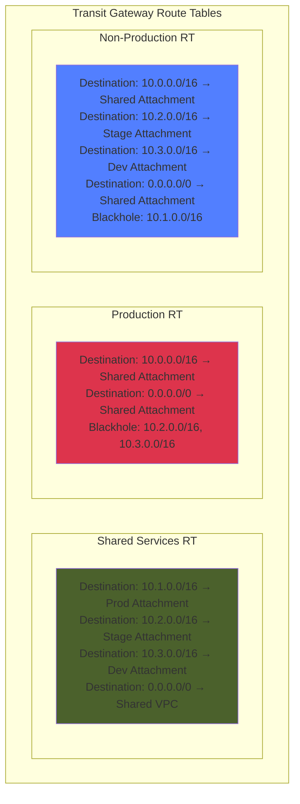
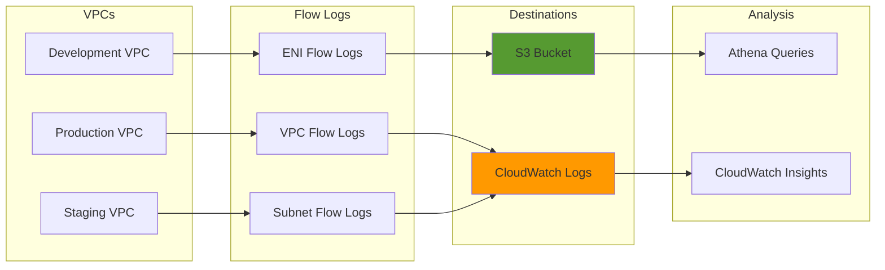
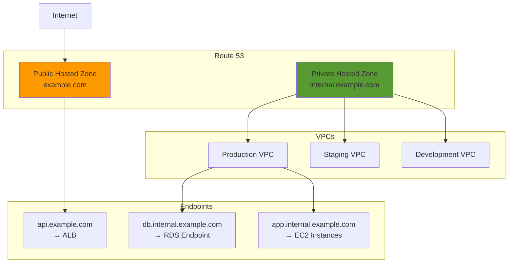

# Network Architecture - Detailed Topology

## Hub-and-Spoke Transit Gateway Architecture

## 3-Tier VPC Architecture (Production Example)

## Security Groups and NACLs

## VPC Endpoints Architecture

## Transit Gateway Routing Tables

## Network Flow Logs Architecture

## IP Address Allocation Strategy

| VPC | CIDR Block | Subnets | Purpose |
|-----|------------|---------|---------|
| **Shared Services** | 10.0.0.0/16 | 65,536 IPs | Transit Gateway Hub |
| - Public | 10.0.0.0/24 | 256 IPs | NAT Gateways, Bastion |
| - Transit | 10.0.1.0/24 | 256 IPs | TGW ENIs |
| - Private | 10.0.2.0/23 | 512 IPs | Shared services |
| **Production** | 10.1.0.0/16 | 65,536 IPs | Production workloads |
| - Public | 10.1.0.0/24 | 256 IPs | Load balancers |
| - Private | 10.1.1.0/24 | 256 IPs | Application tier |
| - Database | 10.1.2.0/24 | 256 IPs | Database tier |
| **Staging** | 10.2.0.0/16 | 65,536 IPs | Pre-production testing |
| - Private | 10.2.1.0/24 | 256 IPs | Application tier |
| - Database | 10.2.2.0/24 | 256 IPs | Database tier |
| **Development** | 10.3.0.0/16 | 65,536 IPs | Development environment |
| - Private | 10.3.1.0/24 | 256 IPs | Application tier |
| - Database | 10.3.2.0/24 | 256 IPs | Database tier |

## DNS Architecture

## Network Best Practices Implemented

### Segmentation
- ✅ Separate VPCs per environment (Prod/Stage/Dev)
- ✅ Separate subnets per tier (Public/Private/Database)
- ✅ Separate security groups per application layer

### High Availability
- ✅ Multi-AZ deployment (minimum 2 AZs)
- ✅ NAT Gateways in each AZ
- ✅ Load balancers across AZs
- ✅ RDS Multi-AZ for production

### Security
- ✅ Private subnets for applications (no direct internet)
- ✅ Database subnets isolated (no route to internet)
- ✅ NACLs as first line of defense
- ✅ Security Groups with least privilege
- ✅ VPC Endpoints for AWS service access

### Scalability
- ✅ /16 CIDR blocks allow for growth
- ✅ Transit Gateway supports 5,000+ attachments
- ✅ Modular design for easy expansion
- ✅ Reserved IP space for future accounts

### Cost Optimization
- ✅ VPC Endpoints reduce NAT Gateway costs
- ✅ Transit Gateway eliminates VPC peering mesh
- ✅ Single NAT Gateway per AZ (balance cost/HA)
- ✅ Flow Logs to S3 for cost-effective storage
